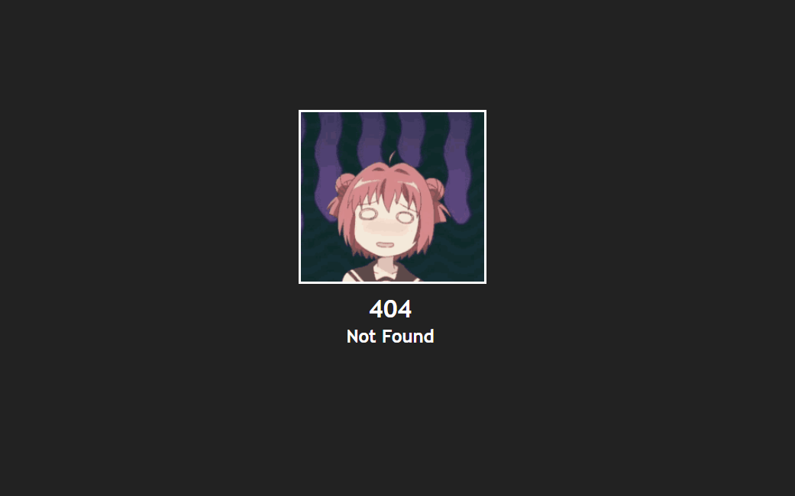
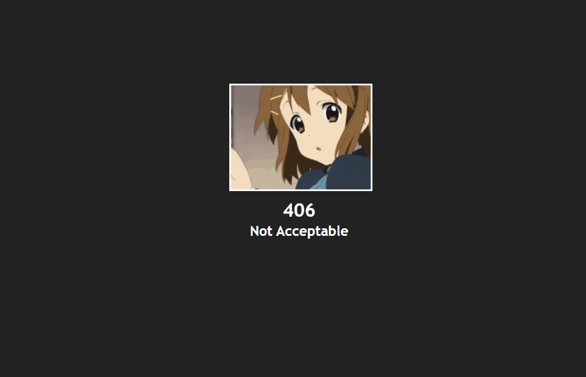

<h1 align="center" id="Template">
    <!-- Text only -->
    <!-- Template -->
    <!-- or, Image logo -->
    
</h1>

<!-- Tag line -->
<h3 align="center">HTTP Error Pages But With Anime Images</h3>

<!-- Badges -->

    

----

<!-- Content -->
## What is this?

You may have come across some pages that says "404 Not Found". Well, that is a HTTP code which means the server has failed to get the requested file/page. There are other types of error codes which have their own meanings. This repo containes most of the Error Code's paegs but with Anime Pictures. Most of them are animated.

<!-- Contributing -->
## Contributing

You can also contribute to this project!
If i missed any HTTP code, Feel free to open an issue with a suitable image for the code and I will add that to the list.

Please make sure to follow the existing standards within the project such as code styles, naming conventions and commenting/documentation.

When you are ready, simply create a pull request for your contribution and I will review it whenever I can!

#
## Examples :

>#### Error Page for 404

>#### Error Page for 406

Read Me Template Based on https://github.com/MattIPv4/template